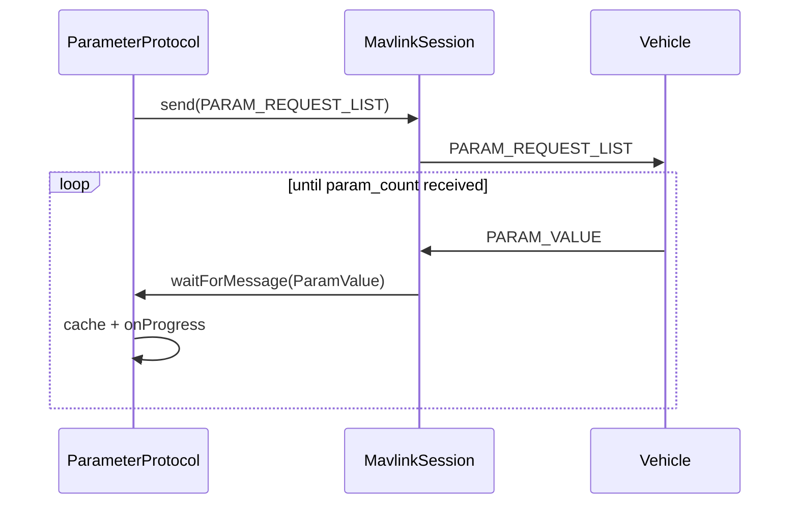
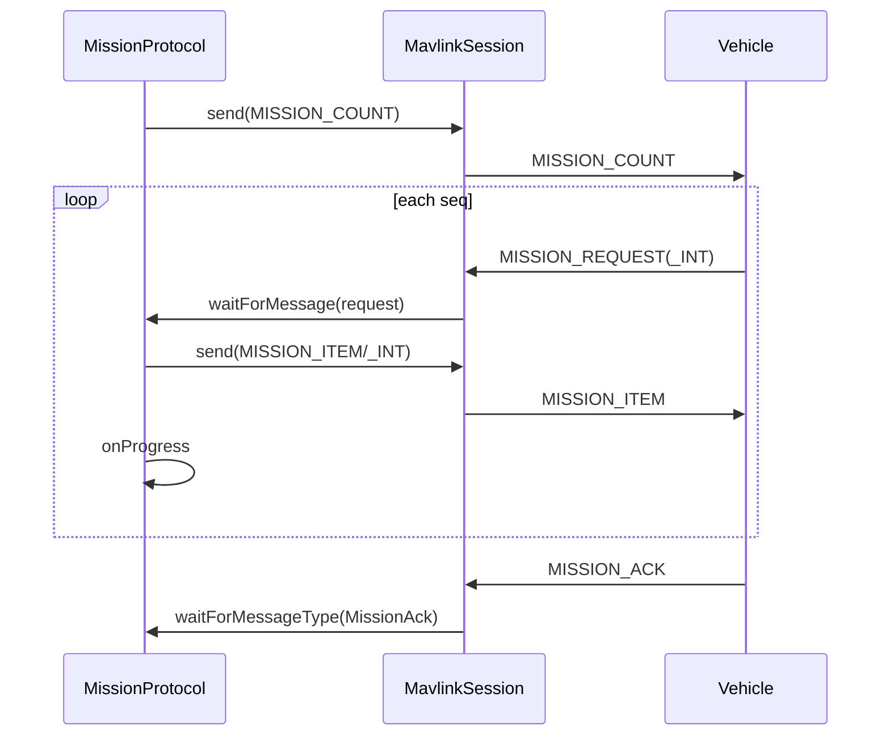
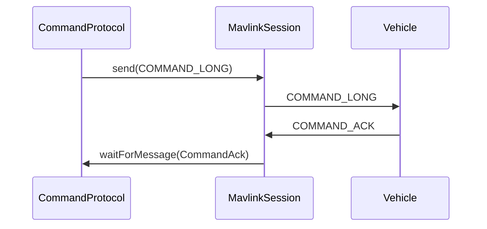

# MAVLink protocol layer — API contract

Cross-language contract for the transport-agnostic MAVLink protocol layer. **Source of truth:** [`templates/dart/protocols/`](../templates/dart/protocols/) and [`templates/dart/mavlink_protocols.dart`](../templates/dart/mavlink_protocols.dart).

All target languages must expose the **same public types and methods** (idiomatic naming per language, identical semantics). Virtual examples use [`templates/dart/examples/protocols_common.dart`](../templates/dart/examples/protocols_common.dart); real serial/SITL apps follow [`examples/dart/`](../examples/dart/).

## Entry points

| Artifact | Purpose |
|----------|---------|
| `mavlink_protocols.*` | Barrel: core runtime + all protocol modules |
| `protocols/` (10 modules) | Link, session, cancellation, codec, heartbeat, parameter, mission, command, vehicle client |
| `examples/protocols_common.*` | Virtual bus helpers for generated protocol examples |

## Default identities (virtual examples & SITL GCS)

| Role | systemId | componentId |
|------|----------|-------------|
| GCS | 255 | 190 |
| Vehicle (simulated) | 1 | 1 |

## Infrastructure

### `MavlinkLink`

Transport abstraction. Protocol code depends only on this interface, not on serial/UDP/TCP.

| Member | Signature (Dart reference) | Semantics |
|--------|--------------------------|-----------|
| `send` | `Future<void> send(Uint8List data)` | Send raw MAVLink frame bytes |
| `receive` | `Stream<Uint8List> get receive` | Incoming raw bytes |
| `close` | `Future<void> close()` | Release resources (default no-op) |

### `VirtualMavlinkBus`

In-memory loopback for tests and virtual examples.

| Member | Semantics |
|--------|-----------|
| `createEndpoint()` | New `MavlinkLink` on this bus; bytes from one endpoint are delivered to all others |
| `closeAll()` | Close every endpoint |

### `MavlinkSession`

Framing, sequencing, and message dispatch over a `MavlinkLink`.

| Member | Semantics |
|--------|-----------|
| Constructor | `dialect`, `link`, `systemId`, `componentId`, optional `version` (default v2) |
| `dialect` | Active dialect |
| `frames` | Broadcast stream of parsed `MavlinkFrame` |
| `send(message)` | Serialize and send typed message |
| `onMessage<T>({fromSystemId, fromComponentId})` | Typed message stream |
| `subscribeMessageId(messageId, {fromSystemId, fromComponentId})` | Stream by MAVLink message id |
| `listenMessage<T>(onData, {fromSystemId, fromComponentId})` | Callback subscription; returns handle with `cancel()` |
| `waitForFrame({predicate, timeout, cancel})` | First matching frame |
| `waitForMessage({predicate, fromSystemId, fromComponentId, timeout, cancel})` | First matching message |
| `waitForMessageType<T>({fromSystemId, fromComponentId, timeout, cancel})` | First message of type `T` |
| `close()` | Cancel waits, stop parser, close link |

### Cancellation & errors

| Type | Semantics |
|------|-----------|
| `MavlinkCancellationToken` | Cooperative cancel: `cancel()`, `isCancelled`, `onCancel`, `throwIfCancelled()`, `dispose()` |
| `MavlinkCancelledException` | Thrown when a wait/operation is cancelled |
| `MavlinkTimeoutException` | Thrown on wait timeout (`message`, `timeout`) |
| `MavlinkMessageSubscription` | Handle from `listenMessage`; `cancel()`, `isActive` |

### `ParamCodec`

Static encode/decode for MAVLink parameter protocol ([spec](https://mavlink.io/en/services/parameter.html)).

| Method | Purpose |
|--------|---------|
| `encodeInt8` / `decodeInt8` | int8 ↔ wire float |
| `encodeUint8` / `decodeUint8` | uint8 ↔ wire float |
| `encodeInt16` / `decodeInt16` | int16 ↔ wire float |
| `encodeUint16` / `decodeUint16` | uint16 ↔ wire float |
| `encodeInt32` / `decodeInt32` | int32 ↔ wire float |
| `encodeUint32` / `decodeUint32` | uint32 ↔ wire float |
| `encodeFloat` / `decodeFloat` | real32 |
| `encodeValue(value, type)` / `decodeValue(encoded, type)` | Typed round-trip |
| `paramIdFromString(name)` | ASCII name → `char[16]` |
| `paramIdToString(id)` | `char[16]` → string |

## Heartbeat

### Types

| Type | Fields / members |
|------|------------------|
| `MavlinkNode` | `systemId`, `componentId`; value equality |
| `TrackedHeartbeat` | `node`, `heartbeat`, `receivedAt`, `online`, `age` |
| `HeartbeatMonitor` | `session`, `timeout`, optional `watch`, `watchSystemId` |
| `HeartbeatPublisher` | `session`, `heartbeat`, `interval` |
| `HeartbeatTemplates` | Static factories: `gcs`, `autopilot`, `onboardApi` |

### `HeartbeatMonitor`

| Member | Semantics |
|--------|-----------|
| `onHeartbeat` | Stream of `TrackedHeartbeat` updates |
| `onConnected` / `onDisconnected` | Node online/offline events |
| `start()` / `stop()` | Begin/end monitoring (single start; stop before restart) |
| `stateFor(node)` / `stateForIds(sys, comp)` | Latest tracked state |
| `isOnline(node)` / `isOnlineIds(sys, comp)` | Connectivity flag |
| `onlineNodes` | Iterable of online nodes |
| `waitForVehicle({excludeSystemIds, timeout, cancel})` | First vehicle heartbeat; monitor must be started |

### `HeartbeatPublisher`

| Member | Semantics |
|--------|-----------|
| `start()` / `stop()` | Periodic transmission |
| `sendOnce()` | Single heartbeat |
| `updateHeartbeat` / `mutateHeartbeat` | Change payload |

## Parameter protocol

### Types

| Type | Purpose |
|------|---------|
| `ParamEntry` | `id`, `value`, `type`, `index`, `count`; `fromParamValue` |
| `ParamProgressCallback` | `(entry, received, expected)` |

### `ParameterProtocol` (GCS client)

| Member | Semantics |
|--------|-----------|
| Constructor | `session`, `targetSystem`, `targetComponent`, `idleTimeout`, `requestTimeout` |
| `cache` | Unmodifiable map of last fetched/written params |
| `clearCache()` | Clear cache |
| `typeForName(name)` | Cached type or null |
| `fetchAll({onProgress, cancel})` | Full param set; optional progress |
| `fetchAllStream({cancel})` | Stream params as they arrive |
| `readByName(name)` / `readByIndex(index)` | Single read |
| `read({paramId, paramIndex, cancel})` | Read by name or index |
| `write({name, value, type, cancel})` | Write and wait for matching `ParamValue` ack |
| `writeByName(name, value, {type, cancel})` | Write using cached type or REAL32 default |

### `ParameterServer` (vehicle)

| Member | Semantics |
|--------|-----------|
| Constructor | `session`, optional `initialValues` map |
| `values` | Unmodifiable store |
| `set(name, value, type)` | Update store |
| `close()` | Unsubscribe |

Handles `ParamRequestList`, `ParamRequestRead`, `ParamSet` on the session.

## Mission protocol

### Types

| Type | Purpose |
|------|---------|
| `MissionItems` | `waypoint`, `toLegacyItem`, `fromLegacyItem`, `withSequentialSeq` |
| `MissionUploadProgressCallback` | `(sent, total, item)` |
| `MissionDownloadProgressCallback` | `(received, total, item)` |
| `MissionSetCurrentResult` | `sequence`, optional `commandAck` |

### `MissionProtocol` (GCS client)

| Member | Semantics |
|--------|-----------|
| Constructor | `session`, `targetSystem`, `targetComponent`, `itemTimeout`, `operationTimeout` |
| `upload(items, {missionType, onProgress, cancel})` | Upload plan → `MavMissionResult` |
| `download({missionType, onProgress, cancel})` | Download plan |
| `clear({missionType, cancel})` | `MISSION_CLEAR_ALL` |
| `setCurrent(seq, {cancel})` | `MissionSetCurrent` only |
| `setCurrentWithCommand(seq, {command, alsoSendCommand, resetMission, cancel})` | Mission message + optional `MAV_CMD_DO_SET_MISSION_CURRENT` |

Supports both `MissionItemInt` and legacy `MissionItem` request/response shapes.

### `MissionServer` (vehicle)

| Member | Semantics |
|--------|-----------|
| Constructor | `session`, optional `initialMission`, `missionType` |
| `items` | Stored mission |
| `replaceMission(items)` | Replace and re-sequence |
| `close()` | Unsubscribe |

## Command protocol

### `CommandProtocol` (GCS client)

| Member | Semantics |
|--------|-----------|
| Constructor | `session`, `targetSystem`, `targetComponent`, `defaultTimeout` |
| `sendLong` / `sendInt` | Send command, wait for ack |
| `commandLong({command, param1..7, confirmation, timeout, cancel})` | Build + send `CommandLong` |
| `requestMessage(messageId, {param2, timeout, cancel})` | `MAV_CMD_REQUEST_MESSAGE` |
| `setMessageInterval(messageId, intervalUs, {timeout, cancel})` | `MAV_CMD_SET_MESSAGE_INTERVAL` |
| `stopMessageInterval(messageId, …)` | Interval 0 |
| `setMissionCurrent(sequence, {resetMission, …})` | `MAV_CMD_DO_SET_MISSION_CURRENT` |
| `arm({force, …})` / `disarm({force, …})` | `MAV_CMD_COMPONENT_ARM_DISARM` |
| `takeoff({altitude, …})` / `land(…)` / `returnToLaunch(…)` | Nav commands |
| `waitForAck(command, {timeout, cancel})` | Wait for matching `CommandAck` |

### `CommandServer` (vehicle)

| Member | Semantics |
|--------|-----------|
| Constructor | `session`, optional `onCommandLong`, `onCommandInt` |
| `close()` | Unsubscribe |

Default handler acks `MavResultAccepted` when no callback is set.

## Vehicle facade

### `MavlinkVehicleClient`

Bundles `ParameterProtocol`, `MissionProtocol`, `CommandProtocol` for one `MavlinkNode`.

| Field | Semantics |
|-------|-----------|
| `session`, `vehicle` | Shared session and target identity |
| `parameters`, `mission`, `command` | Protocol clients |
| `targetSystem`, `targetComponent` | From vehicle node |

### `MavlinkGcs`

GCS bootstrap: session + heartbeat publisher + monitor.

| Member | Semantics |
|--------|-----------|
| `start()` | Start monitor + publisher |
| `stopHeartbeats()` | Stop both |
| `waitForVehicle({excludeSystemIds, timeout})` | Discover vehicle → `MavlinkVehicleClient` |
| `vehicleClient(vehicle)` | Client for known node |
| `MavlinkGcs.connect({dialect, link, systemId, componentId, heartbeatInterval, heartbeatTimeout})` | Factory |
| `close()` | Stop heartbeats, close session |

## Protocol sequence diagrams

### Parameter fetch (`fetchAll`)

### Mission upload

### Command with ack (e.g. arm)

## Generated examples (10 per dialect)

Suffixes (see [`src/generate/examples.rs`](../src/generate/examples.rs)):

| Group | Suffix | Classes exercised |
|-------|--------|-------------------|
| Low-level | `heartbeat` | Message serialize/parse |
| Low-level | `mission_upload` | Raw mission messages |
| Low-level | `request_telemetry` | `CommandLong` + `Attitude` |
| Low-level | `request_parameters` | Param request/value messages |
| Protocol | `protocol_mission` | `MissionProtocol`, `MissionServer` |
| Protocol | `protocol_parameters` | `ParameterProtocol`, `ParameterServer` |
| Protocol | `protocol_command` | `CommandProtocol`, `CommandServer` |
| Protocol | `protocol_heartbeat` | `HeartbeatMonitor`, `HeartbeatPublisher` |
| Protocol | `protocol_vehicle` | `MavlinkGcs`, `MavlinkVehicleClient` |
| Protocol | `protocol_subscribe` | `MavlinkSession.listenMessage` |

Static helpers: `common.*` (low-level) + `protocols_common.*` (virtual link).

## SITL GCS application flow

Reference: [`examples/dart/bin/sitl_gcs.dart`](../examples/dart/bin/sitl_gcs.dart).

1. Pick serial port + baud (default **57600**, `--baud` override).
2. `MavlinkGcs.connect` → `start()` → `waitForVehicle` (60 s timeout, exclude GCS system id).
3. `ParameterProtocol.fetchAll(onProgress:, cancel:)` — full param sync.
4. Interactive CLI until `quit` / EOF.

### CLI commands

Aliases shown in parentheses where applicable.

| Command | API | Notes |
|---------|-----|-------|
| `help` (`h`) | — | Print command list |
| `hb` | `HeartbeatMonitor.isOnline`, `stateFor` | Link / heartbeat status |
| `cancel` | `MavlinkCancellationToken.cancel()` | Abort in-flight param/mission op |
| `params` (`p`) | `ParameterProtocol.fetchAll` | Full list with progress |
| `pr <name>` | `ParameterProtocol.readByName` | Single read |
| `pw <name> <value>` | `ParameterProtocol.writeByName` | Type from cache or REAL32 |
| `mu` | `MissionProtocol.upload` | Hardcoded sample mission |
| `md` | `MissionProtocol.download` | List onboard items |
| `mc` | `MissionProtocol.clear` | `MISSION_CLEAR_ALL` |
| `ms <seq>` | `MissionProtocol.setCurrentWithCommand` | Mission + `MAV_CMD_DO_SET_MISSION_CURRENT` |
| `rm <msgId>` | `CommandProtocol.requestMessage` | One-shot message request |
| `si <msgId> <us>` | `setMessageInterval` / `stopMessageInterval` | `100000` = 10 Hz; `0` = stop |
| `att [seconds]` | `listenMessage<Attitude>` + `setMessageInterval` | Default 5 s stream |
| `arm [force]` | `CommandProtocol.arm` | Optional `force` safety override |
| `disarm [force]` | `CommandProtocol.disarm` | Optional `force` |
| `rtl` | `CommandProtocol.returnToLaunch` | Return to launch |
| `quit` (`q`, `exit`) | — | Exit CLI / app |

Phase 2 real examples in `examples/<lang>/` must implement the **same command set and semantics** as Dart (cross-platform serial where possible).

## Language porting notes

| Group | Languages | Async model |
|-------|-----------|-------------|
| A | Python, TypeScript, JavaScript, C#, Rust | `async`/`await`, promises, tasks, streams — mirror Dart `Future`/`Stream` |
| B | C, C++ | Callbacks + blocking `wait_for_message(timeout_ms)`; same operation names |

C/C++ do not copy Dart `Future`, but **must preserve operation names and semantics** listed above.

## Test anchor

Use `mavlink/message_definitions/v1.0/rt_rc.xml` (`RT_RC_CHANNELS` id 45000, crc_extra **247**, enum `RtRcControlId`). Mirror assertions from `generates_dart_runtime_files` and `generates_dart_example_files` in [`tests/generator.rs`](../tests/generator.rs).
